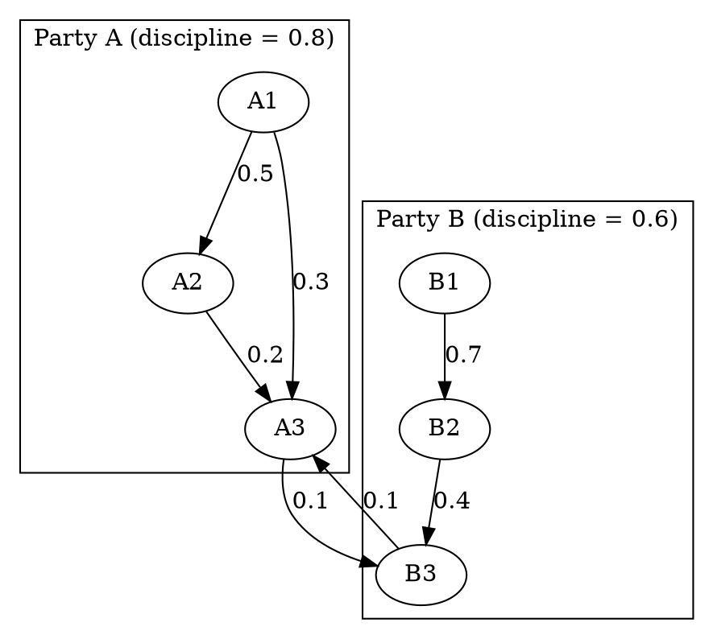

prompt: Write rust code based on the design. Crates you may want to use petgraph(latest version 0.8.2), ndarray(0.16.1) or nalgebra(0.33.2), rand and other necessary crates. You are expected to write a modular framework(should be like a lib, providing api to users). High level design(skip the NLP stuffs)

**NB**: It's in very early stage, design may change over time.

## What for
The following design is a framework aiming to simulate decision making process towards given proposal(in natural language) in a multi-party congress.  
In this framework, each node represents individual congressman, and graph illustrates how a party works.  
Each node has:
	1. an ​ideal-point​ in an N-dimensional issue space
	2. a set of personal modifiers (e.g. “eagerness,” “seniority,” “ambition”, etc.)
	3. ties to other congressmen (e.g. party leaders or peers) each with a weight representing influence  

A “proposal” is just another vector in the same N-dimensional space.  Each congressman computes a utility (or “want-to-vote”) by combining:
	- How close the proposal is to his own ideal point
	- A party-discipline pressure term (leaders + peers)
	- His personal eagerness (or laziness)

## Preprocessing(NLP)
Embedding -> linear regression(?)  
goal: Map natural language into multi-dimension space(political compass with at least 8 or 12 axes)


## Example
### Graph structure (Graphviz DOT)


- Each arrow X→Y has a weight `wXY ∈ [0,1]` reflecting “how much X tries to pull Y.”  
- Each cluster has a party‐discipline scalar `PD ∈ [0,1]`.  

### High-level data structures
```text
Node {
  id                // e.g. "A1"
  ideal[N]          // N-dimensional policy position
  personal_bias     // +vote eagerness / –apathy
  swingability      // how easily this node flips under peer pressure [0..1]
  current_vote      // –1=no, +1=yes, 0=abstain
}

Edge {
  from, to
  weight            // influence strength [0..1]
}

Party {
  discipline_factor // how much each member cares about voting with party [0..1]
  members: [Node]
}

```

### Simulation loop (pseudocode)
``` text
INPUT:
  proposal: vector[N]
  parties: list of Party
  edges: list of Edge
  max_rounds = 5

// 1) INITIAL VOTE SCORES
for each node in all parties:
  alignment = similarity(node.ideal, proposal)    // e.g. cosine or –EuclidDist
  base_score = alignment + node.personal_bias
  node.current_score = base_score

// 2) ITERATIVE INFLUENCE PROPAGATION
for round in 1..max_rounds:
  for each node in random_order(all nodes):
    // A) peer pressure sum:
    peer_sum = 0
    total_w  = 0
    for each incoming edge e where e.to == node.id:
      peer = lookup_node(e.from)
      // peer’s *current opinion* (+1/–1):
      peer_op = clamp(peer.current_score, -1, +1)
      peer_sum += e.weight * peer_op
      total_w  += e.weight

    avg_peer_pressure = if total_w>0 then peer_sum / total_w else 0

    // B) party discipline pressure:
    my_party = find_party_of(node)
    // party tries to pull node toward the party’s mean vote so far
    party_mean = average( m.current_vote for m in my_party.members )
    party_pressure = my_party.discipline_factor * party_mean

    // C) mix everything with node’s swingability
    // swingability=1 means “fully reacts to social pressure”
    // swingability=0 means “stuck to my base”
    social_component = node.swingability * (avg_peer_pressure + party_pressure)

    // D) update node’s score (you can use decay or momentum)
    node.current_score = (1 - node.swingability) * node.current_score
                        + social_component
  end for
end for

// 3) FINALIZE VOTE (thresholding or probabilistic)
for each node:
  node.current_vote = if node.current_score > +θ then +1
                      else if node.current_score < -θ then -1
                      else 0    // abstain

OUTPUT: collection of node.current_vote

```

### Explanation of key steps
	1. Initial score
		- `alignment` measures how close the proposal is to your ideal point.
		- Add a `personal_bias` so some people are naturally enthusiastic or standoffish.
	2. Peer influence
		- We average incoming peers’ current “vote opinion” (±1) weighted by the edge strength.
		- A highly connected influencer (big out‐degree) repeatedly swings their neighbors.	
	3. Party discipline
		- We compute the party’s current mean vote (could use planned whip count or leader’s position).
		- We multiply by a global discipline_factor so that e.g. discipline=0.8 makes members mostly follow.
	4. Swingability
		- Parameter in [0,1].  At 1, a node fully resets its score to social pressures each round.
		- At 0, it never changes from its “base_score”—a true stubborn ideologue.	
	5. Iterative rounds
		- Allows “ripples” of influence: a swing node flips, then pulls along its own sub‐neighbors.
		- You can randomize update order to break symmetry.
	6. Thresholding
		- Choose θ=0 for a simple zero‐line cutoff, or θ>0 if you want an abstention band.
		- Optionally replace threshold with a logistic‐probabilistic draw for fuzzier behavior.